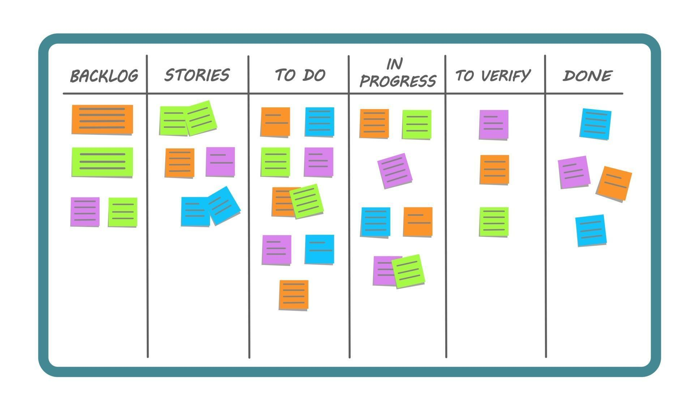

# SAS App Projects

Are you looking to build a SAS Powered App?  Modernise a legacy AF/SCL or SAS/IntrNet application?  Perhaps, migrate an existing SAS 9, Stored Process driven interface to Viya?

The SAS Apps Team have _significant_ experience with SAS App Development, being the creators and maintainers of:

* [SASjs](https://github.com/sasjs) – an open source (MIT) DevOps framework for App Development on **all** SAS Platforms
* The SCL Transcoding Kit – an accelerator for migrating large volumes of AF/SCL to SAS 9 or Viya
* [Data Controller](https://datacontroller.io) – a commercial data ingestion solution with enterprise data validation and audit capabilities

We regular push apps (such as SAS tools, seed apps, and games) directly to GitHub:  https://github.com/topics/sasjs-app

Thanks to our plethora of existing tools, and extensive project experience, we can scope/estimate most projects **and** deliver an inital (functional) SAS-Powered interface in as little as 2-3 weeks.

This includes the frontend interface, backend SAS services/jobs/tests/database, user guide, developer guide, admin guide, frontend JS docs (typedoc) backend SAS docs (doxygen), and full CI/CD pipeline (YAML) into your preferred SAS environment - ie Viya, SAS 9 EBI, or Foundation SAS.

From there we iterate through multiple phases (checkpoints) to the final deliverable, finishing up with:

* A handover and warranty period (X days over X months), and/or
* An SLA for continued support and development

Note that, in most cases, **we don't need access to your environment**! Just provide us the source code, the data _structure_, catalogs etc - and some time to interview your end users / any available technical specialists.  Sample data is a bonus - if not available, we would look to build up some meaningful test data for you as part of the project.

For questions, or to book a discovery call, contact [Allan Bowe](https://www.linkedin.com/in/allanbowe/).

